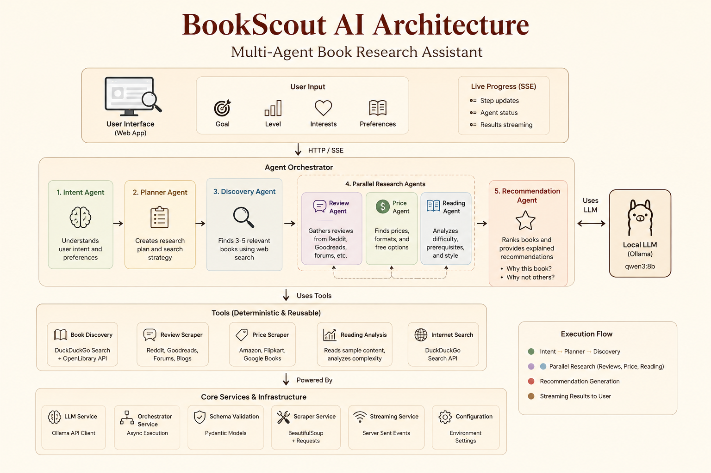
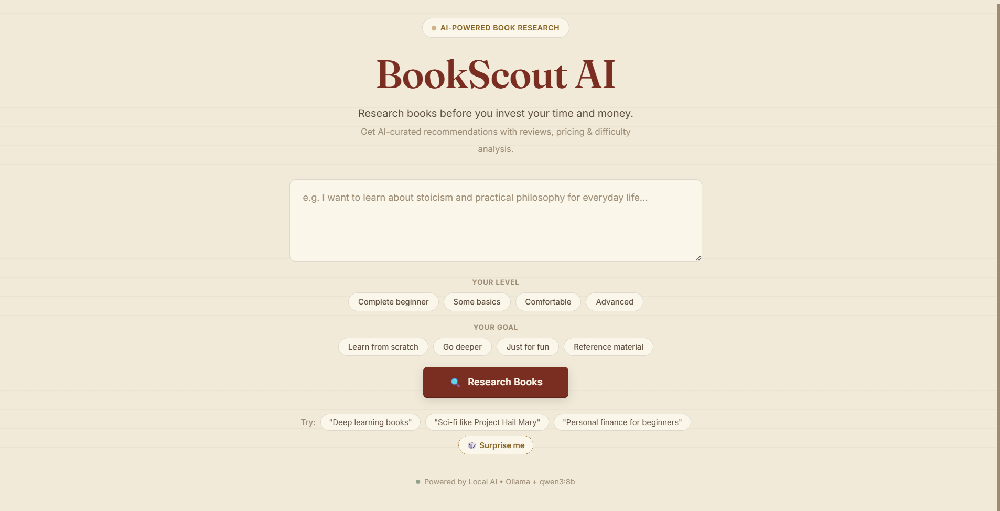
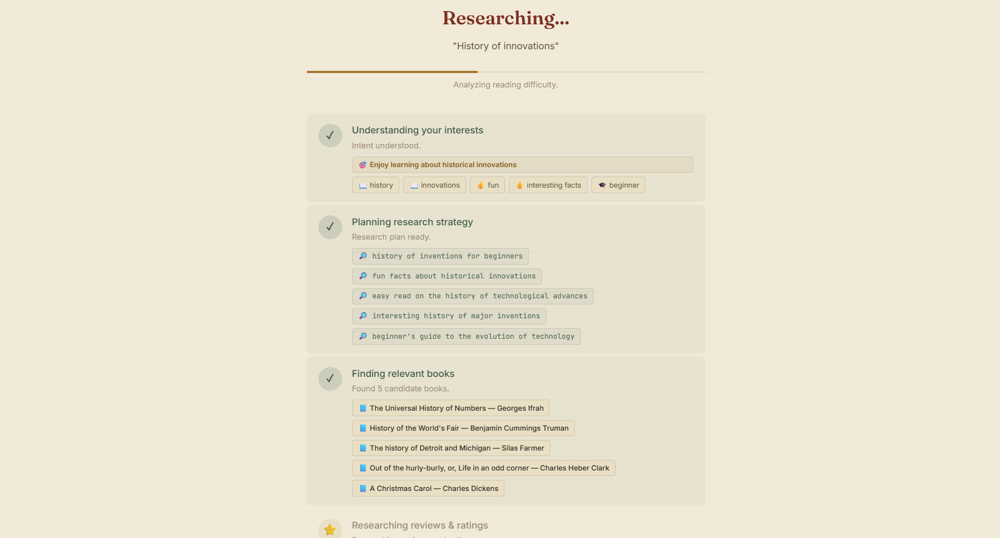
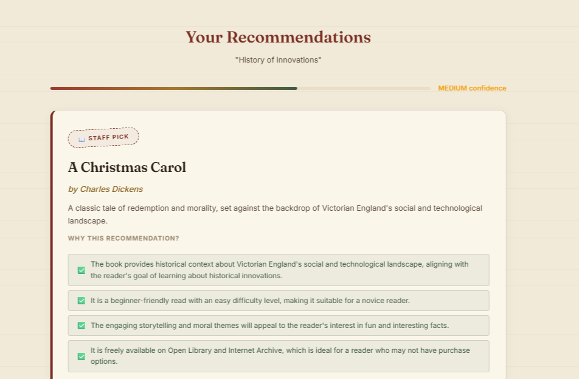
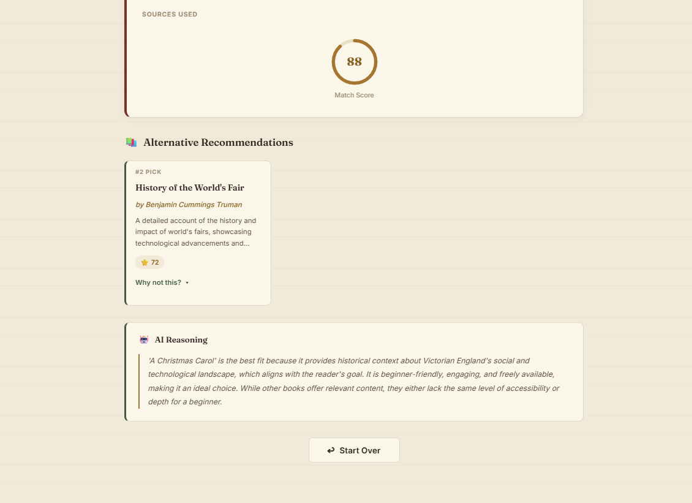

# 📚 BookScout AI

> **Research books before you invest your time and money.**

BookScout AI is a **multi-agent AI Book Research Assistant** built for the **Google AI Agents & Vibe Coding Capstone**.

Instead of recommending books based only on popularity, BookScout AI researches books on your behalf. Multiple specialized AI agents collaborate to understand your intent, discover relevant books, analyze reviews, compare pricing, estimate reading difficulty, and explain *why* a book is recommended.

---

## 🎬 Demo

### Live Demo

https://youtu.be/q9eWOHH_HAA?si=knTxrIi3v3AiD1p8

### Quick Preview

<p align="center">

</p>

---

# 🎯 Problem

Choosing the right book is expensive—not just in money, but in time.

Most recommendation systems answer:

> **"What should I read?"**

BookScout AI answers:

> **"Why should I read this book?"**

Each recommendation is backed by research, reviews, pricing, reading difficulty, and transparent reasoning generated by a team of specialized AI agents.

---

# 🏗 Architecture

<p align="center">

</p>

BookScout AI follows a multi-agent architecture where specialized agents perform one task well instead of relying on one large prompt.

```
User
   │
Intent Agent
   │
Planner Agent
   │
Discovery Agent
   │
┌───────────────┬───────────────┬───────────────┐
│               │               │
Review Agent   Price Agent   Reading Agent
│               │               │
└───────────────┴───────────────┘
        │
Recommendation Agent
        │
Final Recommendation
```

Research agents execute in parallel using `asyncio`, while progress is streamed live to the frontend using **Server-Sent Events (SSE)**.

---

# ✨ Features

- 🤖 Multi-Agent Architecture
- 📚 Intent-aware book recommendations
- ⚡ Parallel research using `asyncio`
- 📡 Live progress updates with SSE
- 🧠 Local LLM using Ollama (`qwen3:8b`)
- 💰 Price comparison
- ⭐ Review aggregation
- 📖 Reading difficulty analysis
- ✅ Explainable recommendations
- ❌ "Why not this?" alternative explanations

---

# 📸 Screenshots

### Landing Page



---

### Live Research Progress



---

### Final Recommendation



---

### Alternative Recommendation



---

# 🛠 Tech Stack

| Component | Technology |
|------------|------------|
| Backend | FastAPI |
| Frontend | HTML, CSS, Vanilla JavaScript |
| Local LLM | Ollama + qwen3:8b |
| Data Validation | Pydantic |
| Web Search | DuckDuckGo + OpenLibrary |
| Web Scraping | BeautifulSoup |
| Streaming | Server-Sent Events (SSE) |
| Concurrency | asyncio |

---

# 📂 Project Structure

```
BookScout-AI
│
├── assets/                 # Images, GIFs and architecture diagram
├── backend/
│   ├── agents/             # Specialized AI agents
│   ├── models/             # Pydantic schemas
│   ├── services/           # LLM & scraper services
│   ├── tools/              # Search & scraping tools
│   ├── utils/
│   └── config.py
│
├── frontend/
│   ├── static/
│   └── templates/
│
├── main.py                 # FastAPI entry point
├── requirements.txt
└── README.md
```

---

# 🚀 Installation & Running

## Prerequisites

- Python 3.11+
- Ollama installed
- qwen3:8b downloaded

### 1. Clone the repository

```bash
git clone https://github.com/Miheer-droid/BookScout-AI.git

cd BookScout-AI
```

### 2. Install dependencies

```bash
pip install -r requirements.txt
```

### 3. Pull the local model

```bash
ollama pull qwen3:8b
```

### 4. Start Ollama

```bash
ollama serve
```

### 5. Run BookScout AI

```bash
python main.py
```

Open:

```
http://localhost:8000
```

---

# 🔄 Replacement Guide

The project is intentionally modular.

The **agents** focus on reasoning, while the **tools** perform deterministic tasks such as search and scraping.

This separation allows the scraping layer to be replaced with APIs (Google Books, Open Library, etc.) without changing the agent logic.

---

# 📄 License

Built as part of the **Google AI Agents & Vibe Coding Capstone Project**.